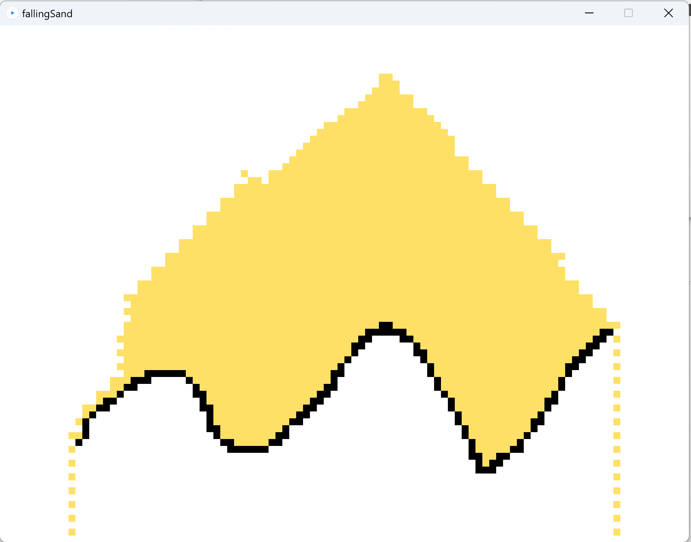

# fallingSand2020
Symulator spadającego piasku. Python/Processing

- LPM - rysowanie przeszkód
- PPM - zrzut piasku
- k,m,o,s - przeszkody o różnych kształtach
- r - wyczyść okno

Uruchamianie w środowisku processing https://processing.org/download
